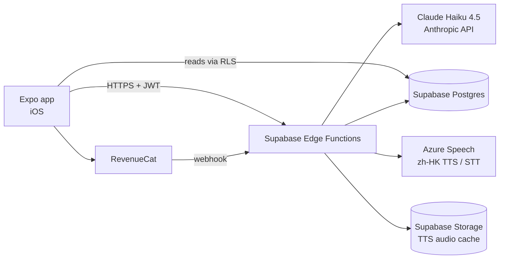
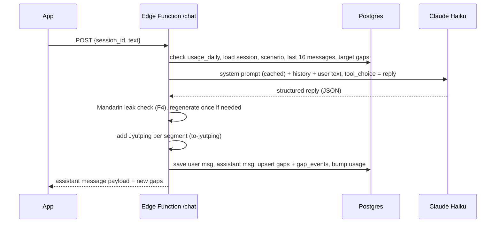

# Cantonese Practice App: Design Document

**Working title:** Gong (講, "to speak")
**Version:** 0.2 (adds Ask panel, learner memory, chat history, one-page summary)
**Platforms:** iOS first (App Store), Android later, built with React Native + Expo

---

## The one-page version (read this first)

**What it is:** You chat with an AI character in Cantonese inside a scenario, like ordering at a diner or meeting your partner's parents. You reply however you can, in Cantonese, Jyutping, or English.

**The edge:** Whenever you get stuck, the app notices. Those words become your personal word list, and future chats quietly steer you into using them again until you can say them without help. No fixed lesson plans.

**What you see:** Three tabs. *Practice* (pick a scenario, start a new chat, or describe something coming up in your life to rehearse). *Word Bank* (every word you've been stuck on, and which ones you've now got). *Settings*.

**Inside a chat:** Each AI message shows Chinese characters, Jyutping, and English, which you can toggle on and off. Tap any word to see what it means. Tap the speaker to hear it. Tap **?** (or type `/btw`) to open a side panel and ask a tutor anything, like "how do I say receipt?" or "why did she say 喎?", without interrupting the roleplay.

**Memory:** Every new chat starts fresh, but the app keeps a short note about you (your name, job, people in your life) and your word list, so the AI feels like it knows you without paying to re-read old chats.

**How it works behind the scenes:** The phone app talks to a small server (Supabase). The server holds the secret keys, talks to the AI (Claude Haiku) and the voice service (Azure), saves everything to a database, and enforces the free daily limit. When the doc mentions names like `/chat` or `/ask`, those are addresses on that server the app calls in the background. Users never see or type them (except `/btw`, which is just a shortcut for the **?** panel).

**Cost:** About $0.80 per typical user per month in AI costs, plus Apple's $99/year. The free tier has a daily message limit. Pro unlocks more.

The rest of this document is the detailed reference for building each piece.

---

## 1. Product summary

A chat-first app for practicing spoken Cantonese. The user picks a scenario (or describes a real situation coming up in their life), and an AI character talks with them in colloquial Hong Kong Cantonese. Whenever the user gets stuck, by falling back to English, asking "how do I say...", or making a mistake, the app records it as a **gap**. Gaps become the user's personal curriculum: future conversations are steered to make the user use those words again until they can produce them without help.

**Tagline:** The app learns what you don't know by listening to you get stuck.

### Product principles

1. **No fixed lesson plans.** Content is driven by the user's own gaps, not a predefined syllabus.
2. **Spoken Cantonese only.** Colloquial Hong Kong Cantonese as people actually talk. No formal written Chinese read aloud, no Mandarin grammar.
3. **Getting stuck is data, not failure.** English fallback is encouraged and rewarded with a clear "here's how you'd say it" moment.
4. **One screen does most of the work.** The chat is the product. Everything else is secondary.
5. **Cheap to run.** Every feature is designed with per-message cost in mind.

### Audience

- **Primary (about 90%):** Adult learners of Cantonese at beginner to intermediate level (partners of Cantonese speakers, people moving to or visiting Hong Kong, Guangzhou, or Macau, people who love Cantonese media).
- **Secondary (about 10%):** Heritage speakers who understand some Cantonese but freeze when speaking. Served through a "Family" scenario pack and the Rehearse mode, not a separate product track.

---

## 2. Feature list and phasing

| ID | Feature | Phase |
|----|---------|-------|
| F1 | Scenario chat engine | MVP |
| F2 | Gap detection ("listening to you get stuck") | MVP |
| F3 | Layered message display (characters / Jyutping / English) and tap-to-gloss | MVP |
| F4 | Spoken Cantonese enforcement (Mandarin leak detector) | MVP |
| F5 | Gap reuse and spaced scheduling | MVP |
| F6 | Word Bank screen | MVP |
| F7 | Built-in scenario library | MVP |
| F8 | Rehearse My Real Life | MVP |
| F9 | Session summary and Cantonese ratio | MVP |
| F10 | Text-to-speech playback | MVP |
| F11 | Accounts and auth | MVP |
| F12 | Usage limits and subscription | MVP (end) |
| F13 | Adaptive difficulty | MVP (simple) then v1.1 |
| F14 | Voice input (speech-to-text) | v1.1 |
| F15 | Tone feedback | v2 (research) |
| F16 | Ask panel (**?** button and `/btw`) | MVP |
| F17 | Learner memory across chats | MVP |
| F18 | New chats and chat history | MVP |

---

## 3. Architecture



The app never holds the Anthropic or Azure keys. All model and speech calls go through Supabase Edge Functions, which also enforce usage limits.

**About names like `/chat`:** these are Edge Function addresses (API endpoints) that the app calls in the background over HTTPS. `POST` means the app is sending data to that address. Users never see them.

### Tech stack

**Client**

- React Native via **Expo** (managed workflow), **Expo Router** for navigation
- **EAS Build** and **EAS Submit** for App Store builds and TestFlight
- **@supabase/supabase-js** for auth and direct reads of the word bank
- **@tanstack/react-query** for server state, **zustand** for small local UI state (display toggles, current session)
- **expo-audio** for playback (and recording in v1.1)
- **expo-apple-authentication** for Sign in with Apple
- **react-native-purchases** (RevenueCat) for subscriptions
- **expo-secure-store** for the auth session

**Server**

- **Supabase**: Postgres, Auth, Storage, Edge Functions (Deno, TypeScript)
- **Anthropic API**, model `claude-haiku-4-5-20251001`, using forced tool use for structured output and prompt caching for the system prompt
- **Azure AI Speech**, `zh-HK` neural voices
- **to-jyutping** (npm, by CanCLID) for converting Chinese characters to Jyutping on the server

---

## 4. Data model

All tables have Row Level Security enabled. Users can only read and write their own rows. Edge Functions use the service role key.

```sql
create table profiles (
  id uuid primary key references auth.users on delete cascade,
  level smallint not null default 1,          -- 1 (absolute beginner) to 5
  display_prefs jsonb not null default
    '{"hanzi": true, "jyutping": true, "english": true, "tone_colors": false}',
  voice text not null default 'zh-HK-HiuMaanNeural',
  speech_rate real not null default 0.85,     -- slower by default for learners
  plan text not null default 'free',          -- 'free' | 'pro'
  memory jsonb not null default '{"facts": []}', -- learner memory note, see F17
  memory_updated_at timestamptz,
  created_at timestamptz not null default now()
);

create table scenarios (
  id uuid primary key default gen_random_uuid(),
  owner_id uuid references auth.users on delete cascade, -- null = built-in
  pack text,                                  -- 'everyday', 'food', 'travel', 'family', 'work'
  spec jsonb not null,                        -- see section 5.7
  is_custom boolean not null default false,
  created_at timestamptz not null default now()
);

create table sessions (
  id uuid primary key default gen_random_uuid(),
  user_id uuid not null references auth.users on delete cascade,
  scenario_id uuid not null references scenarios,
  target_gap_ids uuid[] not null default '{}', -- gaps injected into this session
  started_at timestamptz not null default now(),
  ended_at timestamptz,
  turn_count int not null default 0,
  cantonese_ratio real,                        -- see F9
  summary jsonb,
  last_message_preview text                    -- for the chat history list, see F18
);

create table messages (
  id uuid primary key default gen_random_uuid(),
  session_id uuid not null references sessions on delete cascade,
  role text not null check (role in ('user', 'assistant')),
  text_raw text not null,                     -- what the user typed, or the hanzi reply
  payload jsonb,                              -- full structured reply for assistant messages
  created_at timestamptz not null default now()
);

create table gaps (
  id uuid primary key default gen_random_uuid(),
  user_id uuid not null references auth.users on delete cascade,
  english text not null,                      -- normalized lemma, lowercase ("receipt")
  hanzi text not null,                        -- "單"
  jyutping text not null,                     -- "daan1"
  kind text not null check (kind in ('production', 'recognition')),
  status text not null default 'new'
    check (status in ('new', 'practicing', 'closed')),
  times_stuck int not null default 1,
  times_used int not null default 0,
  interval_days real not null default 0,
  next_due_at timestamptz not null default now(),
  first_used_at timestamptz,
  created_at timestamptz not null default now(),
  last_seen_at timestamptz not null default now(),
  unique (user_id, hanzi, kind)
);

create table gap_events (
  id uuid primary key default gen_random_uuid(),
  gap_id uuid not null references gaps on delete cascade,
  session_id uuid references sessions on delete set null,
  message_id uuid references messages on delete set null,
  kind text not null check (kind in ('fallback', 'asked', 'corrected', 'tapped', 'used')),
  created_at timestamptz not null default now()
);

create table side_questions (                 -- Ask panel, see F16
  id uuid primary key default gen_random_uuid(),
  session_id uuid not null references sessions on delete cascade,
  question text not null,
  answer jsonb not null,                      -- { text, examples: [{hanzi, english}] }
  created_gap_id uuid references gaps on delete set null,
  created_at timestamptz not null default now()
);

create table usage_daily (
  user_id uuid not null references auth.users on delete cascade,
  day date not null,
  messages int not null default 0,
  side_questions int not null default 0,
  tts_chars int not null default 0,
  primary key (user_id, day)
);

create table tts_cache (
  hash text primary key,                      -- sha256(voice + rate + text)
  storage_path text not null,
  created_at timestamptz not null default now()
);
```

---

## 5. Feature specifications

### F1. Scenario chat engine

**What the user sees:** A chat thread. The AI character opens the conversation. The user types a reply (in Cantonese characters, Jyutping, English, or any mix). The character replies in Cantonese, staying in role.

**Flow for one turn**



**Endpoints**

- `POST /session-start { scenario_id }` creates a session, selects target gaps (F5), generates the opening line, returns `{ session_id, message }`.
- `POST /chat { session_id, text }` runs one turn as above.
- `POST /session-end { session_id }` computes the summary (F9) and updates learner memory (F17).

**Model call details**

- Model: `claude-haiku-4-5-20251001`, `max_tokens: 600`, `temperature: 0.7`.
- Structured output via **forced tool use**: define one tool, `reply`, whose input schema is the reply format below, and set `tool_choice: { type: "tool", name: "reply" }`. The model must answer by "calling" the tool, so the server always receives valid JSON.
- **Prompt caching:** the static part of the system prompt (rules, Cantonese style guide, output instructions) goes first with `cache_control: { type: "ephemeral" }`. The dynamic part (scenario, level, target gaps) comes after.
- **Context:** send only the last 16 messages. Sessions are capped at 40 user turns, after which the character naturally wraps up the scene.
- History is sent in a compact form: user messages as typed, assistant messages as hanzi only (no Jyutping, no English) to save tokens.

**Reply schema (tool input)**

```json
{
  "segments": [
    { "hanzi": "你好", "gloss": "hello" },
    { "hanzi": "，", "gloss": "" },
    { "hanzi": "想食啲咩", "gloss": "what would you like to eat" },
    { "hanzi": "呀", "gloss": "(softening particle)" }
  ],
  "english": "Hello, what would you like to eat?",
  "gaps": [
    { "english": "receipt", "hanzi": "單", "source": "fallback" }
  ],
  "corrections": [
    { "user_said": "我是學生", "better": "我係學生", "note": "Cantonese uses 係, not 是" }
  ],
  "targets_used": ["<gap uuid>"],
  "scenario": { "goal_met": false }
}
```

Field meanings:

- `segments`: the reply broken into word-sized chunks, each with a short English gloss. Powers tap-to-gloss and per-word Jyutping (F3).
- `english`: natural translation of the whole reply.
- `gaps`: words or phrases the user said in English (or asked about) in their last message, with the Cantonese the user should have used.
- `corrections`: Cantonese the user produced that was wrong or unnatural. At most 2 per turn, so the conversation stays fun.
- `targets_used`: IDs of target gaps the user correctly produced in Cantonese in their last message.
- `scenario.goal_met`: whether the scenario goal is now complete.

**System prompt skeleton**

```
[STATIC, CACHED]
You are a roleplay partner helping someone practice spoken Hong Kong Cantonese.
Stay in character at all times. Never lecture. Keep replies short and natural.

Language rules:
- Write colloquial spoken Cantonese in Traditional characters (係, 唔, 嘅, 咗, 冇, 佢, 喺, 睇, 講, 咩, 嗰, 呢).
- Never use Mandarin forms (是, 不, 的 as possessive, 了, 沒有, 他/她, 在, 看, 說, 什麼, 那, 這).
- Use sentence-final particles naturally (呀, 啦, 喎, 囉, 嘅, 咩, 吖).
- English loanwords common in Hong Kong speech are fine (e.g. 的士, OK, check).

The learner may write in Chinese characters, Jyutping, English, or a mix.
Understand all of these. Never switch to English yourself.

When the learner uses English for a word or phrase, continue the conversation
as if they said it, and record it in "gaps" with the natural Cantonese.
When the learner makes a Cantonese mistake, keep the conversation going and
record at most 2 "corrections".

Output only by calling the reply tool.

[DYNAMIC]
Learner level: {level}. Rules: {level_rules}
About the learner (from earlier chats, use naturally, never recite): {memory.facts}
Scenario: {scenario.setting}
You are: {character.name}, {character.role}. Personality: {character.personality}.
The learner is: {scenario.user_role}. Their goal: {scenario.goal}.
Beats to move through: {scenario.beats}

Target words: try to create natural openings for the learner to say these.
Do not say them yourself unless the learner is stuck twice.
{for each target gap: id, english, hanzi}
```

`level_rules` examples:

- Level 1: "Replies of 1 short sentence, under 10 characters. Very common words only. Ask yes/no or either/or questions."
- Level 3: "Replies of 1 to 2 sentences. Everyday vocabulary. Open questions are fine."
- Level 5: "Natural native speed and length. Slang and idioms welcome."

### F2. Gap detection ("listening to you get stuck")

This is the core feature. A gap is any word or phrase the user could not produce or understand. There are four ways a gap is detected:

| Signal | How it is captured | Gap kind | Event kind |
|--------|-------------------|----------|-----------|
| English fallback | Model returns it in `gaps` with `source: "fallback"` | production | fallback |
| "How do I say..." | User asks in the Ask panel (F16), or asks directly in the chat | production | asked |
| Mistake | Model returns it in `corrections` | production | corrected |
| Didn't understand | User taps a segment in an AI message to see its gloss | recognition | tapped |

**Server logic (in `/chat`)**

1. **Pre-check (cheap, no model needed):** detect Latin-script runs in the user text with a regex. If the user typed Jyutping (Latin letters followed by tone digits 1 to 6, like `nei5 hou2`), treat it as Cantonese, not English. This flag is used as a sanity check on what the model reports.
2. **Normalize** each gap from the model: lowercase the English, trim, strip articles ("a receipt" becomes "receipt"). Generate Jyutping server-side from the hanzi.
3. **Upsert** into `gaps` on `(user_id, hanzi, kind)`:
   - New row: `status = 'new'`, `times_stuck = 1`, `next_due_at = now()`.
   - Existing row: `times_stuck += 1`, `interval_days = 0`, `next_due_at = now()`, `status = 'practicing'` if it was `closed` (the gap reopens).
4. Insert a `gap_events` row linking the gap to the message.
5. Return the new gaps to the client so it can show an inline **"Say it like this: 單 (daan1), receipt"** chip under the user's message.

**"How do I say..." questions**

These are handled by the Ask panel (F16). If the user asks "how do you say X" directly in the roleplay chat instead, the model records it in `gaps` with `source: "asked"`, answers briefly in character (for example, the waitress pointing and saying the word), and continues the scene.

**Tap-to-gloss**

Tapping a segment in an AI bubble shows its gloss and Jyutping in a tooltip and plays its audio. The client calls `POST /gap-tap { message_id, segment_index }`, which upserts a `recognition` gap. Recognition gaps are tracked separately because understanding a word and being able to say it are different skills.

### F3. Layered message display

Each AI message bubble has three layers, controlled by global toggles in the chat header:

```
 ┌───────────────────────────────┐
 │ 你好，想食啲咩呀？             │  ← hanzi (always shown unless toggled)
 │ nei5 hou2, soeng2 sik6 di1     │  ← Jyutping, aligned per segment
 │ me1 aa3?                       │
 │ Hello, what would you like?    │  ← English (tap to reveal by default at level 3+)
 │                          🔊    │
 └───────────────────────────────┘
```

**Implementation**

- Render each segment as its own `Pressable` column: hanzi on top, Jyutping below, so they stay aligned and each word is tappable.
- Jyutping is **generated on the server** with `to-jyutping`, not by the model. Language models are unreliable at romanizing Cantonese and often guess tones wrong. A library based on a pronunciation dictionary is far more accurate.
- Heteronyms (characters with more than one reading) are the main source of errors. Keep a small override table in the server (for example per-word readings) and grow it as testers report issues.
- **Tone colors (optional toggle):** color each Jyutping syllable by its tone number (6 colors). This helps learners see tone patterns without extra cost.
- **Defaults by level:** level 1 to 2 show all three layers. Level 3+ show hanzi and Jyutping with English hidden behind a tap. Users can override.
- Characters are **Traditional** by default, matching Hong Kong usage.

### F4. Spoken Cantonese enforcement (Mandarin leak detector)

Models sometimes drift into Mandarin vocabulary or grammar. Prompting reduces this but does not eliminate it, so the server checks every reply.

**Detector** (pure TypeScript, runs in microseconds):

- Keep a weighted list of Mandarin markers: 是, 不, 的, 了, 沒有/没有, 他, 她, 在, 看, 說/说, 什麼/什么, 那, 這/这, 們/们.
- Keep an allowlist of Cantonese words that contain those characters so they don't trigger false alarms: 的士, 但係, 不過, 不如, 是但, 睇下, 實在, 現在, 存在, and so on. Remove allowlisted words from the text before scanning.
- Also check for the presence of strong Cantonese markers (係, 唔, 嘅, 咗, 冇, 佢, 喺, 啲, 嘢, 嚟, 乜, 咩). A reply with zero Cantonese markers and more than 6 characters is suspicious.
- Score = sum of Mandarin marker weights, plus 2 if no Cantonese markers.

**Action:**

- Score 0 to 1: accept.
- Score 2 or more: regenerate once, appending a correction message ("Your last reply used Mandarin forms: X, Y. Rewrite in colloquial Cantonese."). If the retry still scores 2 or more, accept it but log it to a `flagged_replies` view for weekly review.

The detector's flag rate becomes a quality metric you watch over time.

### F5. Gap reuse and spaced scheduling

Gaps only matter if they come back. Each session targets up to 5 gaps.

**Selecting targets (at `/session-start`):**

1. Take production gaps where `status != 'closed'` and `next_due_at <= now()`, ordered by `next_due_at` then `times_stuck` descending.
2. Prefer gaps that fit the scenario. Do this cheaply: pass up to 15 candidates into the opener call and let the model pick the 5 that fit naturally (it returns their IDs in the opener tool call). No embeddings needed.
3. Store the chosen IDs in `sessions.target_gap_ids` and include them in the dynamic system prompt.

**Detecting successful use:**

- Primary: the model returns `targets_used` with gap IDs.
- Backup: the server checks whether the gap's hanzi appears in the user's message. If the model and string match disagree, trust the string match only when the user typed characters (not when they typed English).
- Only counts as a success if the user produced it without the character saying it first in the previous 2 messages (checked server-side against recent assistant messages). This stops "parroting" from closing gaps.

**Scheduling (simplified SM-2):**

| Event | Effect |
|-------|--------|
| Stuck again (fallback, asked, corrected) | `interval_days = 0`, `next_due_at = now()`, `times_stuck += 1` |
| Used correctly, first time | `interval_days = 1`, `status = 'practicing'`, `first_used_at = now()` |
| Used correctly, later | `interval_days = min(interval_days * 2.5, 60)` |
| Used correctly 3 times, spanning at least 7 days since `first_used_at` | `status = 'closed'` |

`next_due_at = now() + interval_days`. Recognition gaps use the same rules, but are "used" when the user responds appropriately to a message containing the word without tapping it.

### F6. Word Bank screen

A simple list with three tabs: **Stuck on** (new), **Practicing**, **Got it** (closed).

Each row shows hanzi, Jyutping, English, a play button, and a small "stuck 3× · used 1×" counter. Tapping a row opens a sheet with the original conversation snippet where the user got stuck (from `gap_events.message_id`), which turns every gap into a small memory.

Top of the screen: total words closed, and "most-stuck word this week".

**Implementation:** read directly from Postgres with the Supabase client (RLS protects it), no Edge Function needed. Paginate 50 at a time with React Query's `useInfiniteQuery`.

### F7. Built-in scenario library

**Scenario spec** (stored in `scenarios.spec`):

```json
{
  "title": "Ordering at a cha chaan teng",
  "setting": "A busy Hong Kong diner at lunchtime.",
  "character": {
    "name": "Auntie Wai",
    "role": "waitress",
    "personality": "fast, blunt, secretly kind",
    "speech_style": "short sentences, lots of 啦 and 喎"
  },
  "user_role": "a customer",
  "goal": "Order a meal and a drink, then ask for the bill.",
  "beats": ["greet and seat", "take order", "upsell a drink", "bring bill"],
  "difficulty": 2,
  "key_phrases": ["唔該", "埋單", "凍檸茶", "走冰"],
  "opener_hint": "Auntie asks how many people, impatiently."
}
```

**Launch set (10 scenarios in 5 packs):**

- **Food:** cha chaan teng order, dim sum with friends
- **Travel:** taking a taxi, asking for directions
- **Everyday:** wet market shopping, phone shop repair
- **Social:** small talk at a party, making weekend plans
- **Family:** dinner with your partner's parents, calling a grandparent

Built-in scenarios are seeded via a SQL migration from a `scenarios/` folder of JSON files in the repo, so a native speaker can review and edit them as plain files.

**Home screen card:** title, character emoji, difficulty dots, and "3 of your words will come up" when target gaps fit.

### F8. Rehearse My Real Life

The user types a description of something coming up, in English: *"I'm meeting my girlfriend's parents for dim sum on Saturday. Her dad doesn't speak English."*

**Flow:**

1. `POST /scenario-generate { description }` calls the model with a tool whose schema is the scenario spec (F7). The system prompt tells it to infer the setting, the other person, a realistic goal, 3 to 5 beats, and key phrases suited to the user's level.
2. The app shows a **preview card**: "You'll be talking with Mr. Chan, your girlfriend's dad. He's polite but a little formal. Goal: introduce yourself and talk about your job." Buttons: **Start**, **Edit**, **Make it harder**.
3. "Edit" lets the user change the character or goal in plain English and regenerates. "Make it harder" bumps difficulty by 1.
4. On Start, the spec is saved as a custom scenario (`is_custom = true`, `owner_id = user`) and a normal session begins.
5. Custom scenarios appear on the home screen under **Your rehearsals** so the user can practice the same one several times before the real event.

**Guardrails:** the generator prompt refuses to roleplay real named public figures and keeps content appropriate. A light keyword check before the call blocks obviously abusive descriptions.

### F9. Session summary and Cantonese ratio

When a session ends (user taps **End**, the scenario goal is met, or the turn cap is reached), `/session-end` computes:

- **Cantonese ratio:** across the user's messages, CJK characters plus Jyutping syllables, divided by (that plus English words). Shown as "You spoke 64% Cantonese." This is the headline progress number and directly reflects the "getting stuck less" promise.
- **New gaps** found this session (with play buttons).
- **Gaps used** successfully this session (the satisfying part).
- **Goal met** or not.
- **Trend:** this session's ratio vs. the user's 7-day average.

No model call needed. Everything is computed from stored data.

### F10. Text-to-speech playback

**Provider:** Azure AI Speech, `zh-HK` neural voices (for example `zh-HK-HiuMaanNeural` female, `zh-HK-WanLungNeural` male). Each scenario character is assigned a voice in its spec so characters sound distinct.

**Endpoint:** `POST /tts { text, voice, rate }`

1. Compute `hash = sha256(voice + rate + text)`.
2. If `tts_cache` has it, return a signed Supabase Storage URL.
3. Otherwise call Azure with SSML (`<prosody rate="...">` for slow mode), save the MP3 to Storage, insert into `tts_cache`, return the URL.
4. Increment `usage_daily.tts_chars`.

**Client:** play with `expo-audio`. Auto-play AI replies is an optional setting (off by default to save cost). A **slow** toggle sets rate to 0.7.

**Cost control:** caching means scenario openers, common phrases, and Word Bank entries are synthesized once and served to everyone. Word Bank audio for a given hanzi is shared across all users.

### F11. Accounts and auth

- **First launch:** Supabase anonymous sign-in, so the user can start chatting with zero friction. All data attaches to the anonymous user ID.
- **After the first session**, prompt (once) to save progress with **Sign in with Apple**, which links the identity to the existing anonymous account so nothing is lost. Email magic link as an alternative.
- **Account deletion** inside Settings (required by App Store rules for apps that support account creation): `POST /delete-account` deletes the auth user, and cascades remove all rows.

### F12. Usage limits and subscription

| | Free | Pro |
|---|---|---|
| Messages per day | 25 | 300 (fair-use cap) |
| Ask panel questions per day | 10 | 100 |
| Rehearse My Real Life | 1 per week | Unlimited |
| TTS | Tap to play | Tap to play + auto-play |
| Word Bank | Full | Full |

**Enforcement** is server-side in `/chat`: increment `usage_daily.messages` in the same transaction that saves the message, and return HTTP 429 with `{ reason: "daily_limit" }` when exceeded. The client shows a friendly "Auntie Wai needs a break, come back tomorrow, or go Pro" screen.

**Payments:** RevenueCat with an App Store monthly and annual subscription. RevenueCat sends a webhook to `POST /revenuecat-webhook`, which sets `profiles.plan`. The client also reads entitlement status from the RevenueCat SDK to update the UI immediately.

### F13. Adaptive difficulty

**MVP (simple):** the user picks a level (1 to 5) on first launch with a one-question picker ("Have you ever had a conversation in Cantonese?"). After each session, if the Cantonese ratio has been above 80% for 3 sessions in a row, suggest moving up a level. If below 30% for 3 sessions, suggest moving down. The user confirms. No silent changes.

**v1.1:** factor in correction rate and how often the user taps to gloss.

### F14. Voice input (v1.1)

- Hold-to-talk button next to the text field. Record with `expo-audio` (16 kHz mono).
- `POST /stt` sends audio to Azure Speech recognition with language `zh-HK`. Optionally enable a second candidate language `en-US` so mixed speech is captured.
- The transcript appears in the text field for the user to **confirm or edit before sending**. This matters because recognition of learner Cantonese with imperfect tones is error-prone, and sending a wrong transcript would create false gaps.
- Hesitation signals become gap data: a pause longer than 3 seconds mid-utterance or an English segment in the transcript marks that spot.

### F15. Tone feedback (v2, research)

Extract pitch contours from the user's recording (on-device or server-side), compare to the TTS reference for the same phrase, and show both curves. Treat this as an experiment. It's hard to do reliably, and the app does not depend on it.

### F16. Ask panel (**?** button and `/btw`)

**What the user sees:** In the middle of a roleplay, the user taps **?** (or types a message starting with `/btw` in the normal chat box). A bottom sheet slides up with a tutor they can ask anything in English: "How do I say receipt?", "Why did she say 喎?", "What's the difference between 唔該 and 多謝?", "Was what I said rude?" The tutor answers briefly in English with Cantonese examples that can be tapped to hear. Closing the sheet returns to the scene. Earlier questions from this chat stay visible in the sheet.

**Key rule:** the Ask panel is completely outside the roleplay. The character never sees these questions, they are not added to the conversation history, and they don't count toward the 16 recent messages.

**Client:**

- The **?** button opens the sheet. In the main input, if the text starts with `/btw`, the client strips the prefix and sends it to the Ask panel instead of the roleplay, and opens the sheet to show the answer.
- The sheet lists `side_questions` for the current session (read directly via RLS).

**Endpoint:** `POST /ask { session_id, question }`

1. Check `usage_daily.side_questions` against the limit (F12).
2. Load the scenario title and the last 6 roleplay messages (so the tutor can answer "what did she just mean?").
3. Call the model with a separate, short tutor prompt and forced tool use:

```
You are a friendly Cantonese tutor helping a learner who is in the middle of a
roleplay. Answer their side question briefly in English (2 to 4 sentences).
Give at most 3 Cantonese examples in colloquial Hong Kong Cantonese, Traditional
characters. If the question is "how do I say X", set say_it with the phrase.
Recent roleplay for context: {last 6 messages}
```

Tool schema:

```json
{
  "answer": "Short English explanation.",
  "examples": [{ "hanzi": "唔該晒", "english": "thanks a lot (for a service)" }],
  "say_it": { "english": "receipt", "hanzi": "單" }
}
```

4. Add Jyutping to every example server-side.
5. If `say_it` is present, upsert a production gap with event `asked` (same logic as F2) and store its ID in `created_gap_id`.
6. Save to `side_questions`, increment usage, return the answer.

General questions (grammar, politeness, culture) don't create gaps.

**Cost:** about 800 input and 250 output tokens, roughly $0.002 per question, about half a chat message.

### F17. Learner memory across chats

**Goal:** each new chat starts fresh, but the AI should feel like it knows the user, without the cost of re-reading old conversations.

**What is stored:** `profiles.memory`, a short list of at most 12 facts in English, each under 15 words. For example: "Name is Alex", "Works as a nurse", "Girlfriend is Mei", "Mei's dad is Mr. Chan, formal", "Loves hiking", "Finds tones 2 and 5 hard".

**Updating it (at `/session-end`):**

1. Send the current memory facts plus the user's messages from this session (not the AI's) to the model with a short prompt: "Update this list of facts about the learner. Add new durable personal facts, update changed ones, drop trivial ones. Max 12 facts. Never store sensitive details like health, finances, or addresses beyond city level."
2. Forced tool use returns `{ "facts": [...] }`. Save it and set `memory_updated_at`.
3. Skip the call if the session had fewer than 4 user messages.

**Using it:** the facts are inserted into the dynamic part of the roleplay system prompt (F1) and the Rehearse generator (F8), so characters can say things like "你今日返工攰唔攰呀?" (tired from work today?) to a nurse.

**User control:** Settings has a **What the app remembers about you** screen listing the facts, each with a delete button, plus **Clear all**.

**Cost:** one call per session, about $0.002. Gaps (F5) already carry vocabulary across chats, so memory only needs personal context.

### F18. New chats and chat history

- Every time the user starts a scenario, a **new session** (chat) is created. Unfinished chats show as a "Continue" card on the Practice tab. Starting a new chat while one is unfinished asks "End the current chat?" and runs `/session-end` on it.
- **Past chats** screen (from the Practice tab): a list of ended sessions with scenario title, date, Cantonese ratio, and `last_message_preview`. Tapping one opens it **read-only**, so the user can review what they said and where they got stuck. Past chats can't be continued, which keeps every session's context small.
- Read directly from Postgres via RLS, paginated with `useInfiniteQuery`.

---

## 6. Screens

The app has six screens. Navigation is a bottom tab bar with three tabs (Practice, Word Bank, Settings).

1. **Practice (home):** "Continue" card for an unfinished chat, a "Rehearse something coming up" text box, scenario packs as horizontal rows, and a "Past chats" link (F18).
2. **Chat:** header with scenario title, layer toggles (字 / jyut / EN), and End button. Message list. Input bar with **?** (opens the Ask panel, F16), text field, send (and mic in v1.1). The Ask panel is a bottom sheet over the chat.
3. **Session summary:** Cantonese ratio, new gaps, gaps used, Practice again / Done.
4. **Word Bank:** three tabs as in F6.
5. **Settings:** level, display defaults, voice and speed, auto-play, "What the app remembers about you" (F17), subscription, sign in, delete account, send feedback.
6. **Past chats:** read-only list and viewer for ended sessions (F18), opened from the Practice tab.

**Visual style:** light background, one accent color, large type (Chinese characters at 22 pt minimum so tones and strokes are readable), plenty of spacing. Dark mode supported via the system setting.

---

## 7. Cost model

Prices are as of October 2026; verify before launch. Claude Haiku 4.5 costs $1 per million input tokens and $5 per million output tokens, and cached input reads are $0.10 per million.

**Per chat message (estimate):**

| Part | Tokens | Cost |
|------|--------|------|
| Static system prompt (cached) | ~1,500 | $0.00015 |
| Dynamic prompt + 16 messages history | ~1,500 | $0.0015 |
| Output | ~400 | $0.0020 |
| **Total** | | **~$0.004** |

**Per user per month:**

- Typical user (10 messages a day, 20 days): about 200 messages, roughly **$0.80** in model costs.
- Heavy free user at the 25/day cap every day: about **$3.00**. The cap is what keeps the free tier sustainable.
- Ask panel and memory updates add roughly $0.002 each, so a typical user adds about $0.10 to $0.20 a month.
- TTS: around 40 characters per reply. Azure's free tier (about 500k characters a month) covers early testing. Caching shared phrases cuts real usage significantly.

**Fixed costs:** Apple Developer Program $99/year. Supabase, Expo, and RevenueCat free tiers cover the MVP and early users.

**Pricing implication:** a Pro subscription in the $6 to $10 a month range leaves comfortable margin even for heavy users.

---

## 8. App Store requirements checklist

- In-app account deletion (F11).
- Sign in with Apple offered alongside any other sign-in method.
- Privacy policy URL and App Privacy "nutrition label" (data collected: user content in conversations, identifiers, usage data).
- Subscriptions via Apple in-app purchase only (RevenueCat handles this), with restore purchases button.
- A "Report this reply" option on AI messages (long-press), which logs to a `reports` table. Good practice for AI-generated content and helpful for review.
- Microphone permission string explaining why (only when voice input ships).

---

## 9. Quality and testing

- **Native speaker review:** each week, sample 50 random AI replies and all flagged ones (F4). Rate naturalness 1 to 5. Target an average of 4 or higher before public launch.
- **Golden conversations:** a fixed set of 20 scripted user inputs per scenario, replayed against the prompt whenever it changes. Check that output parses, Mandarin score stays low, and gaps are detected for known English words.
- **Unit tests:** `/btw` routing in the input bar (F16), memory fact limits (F17), gap scheduling rules (F5), Cantonese ratio calculation (F9), Mandarin detector with its allowlist (F4), Jyutping input detection (F2).
- **Analytics (lightweight, privacy-respecting):** sessions per user per week, average Cantonese ratio over time, gaps closed per user, day-7 retention. These answer the one question that matters: are people getting stuck less?

---

## 10. Build plan

| Milestone | Scope | Rough timing |
|-----------|-------|-------------|
| M0 | Expo project, Supabase project, schema migration, anonymous auth, EAS build to a device | Week 1 |
| M1 | Chat loop with one scenario: `/session-start`, `/chat`, structured reply, layered display, Jyutping | Weeks 2 to 3 |
| M2 | Gap detection, Ask panel (**?** and `/btw`), tap-to-gloss, Mandarin detector | Weeks 4 to 5 |
| M3 | Gap reuse and scheduling, Word Bank screen, session summary, learner memory, new chats and past chats | Week 6 |
| M4 | TTS with caching, 10 built-in scenarios, Rehearse My Real Life | Week 7 |
| M5 | Usage limits, Sign in with Apple, RevenueCat, settings, account deletion | Week 8 |
| M6 | TestFlight beta with 10 to 20 learners, native speaker review, prompt tuning | Weeks 9 to 10 |
| M7 | App Store submission | Week 11 |
| v1.1 | Voice input, adaptive difficulty improvements, Android | After launch |

---

## 11. Open questions

1. Who is the native speaker reviewer for scenarios and weekly reply checks?
2. Should Simplified characters be offered as a toggle (for learners from a Mandarin background), or stay Traditional only?
3. Free tier limit: is 25 messages a day generous enough to hook people, or should the first week be unlimited?
4. Should Jyutping input be promoted (with a tip about the iOS Cantonese keyboards), or left as a hidden capability?
5. App name and branding.
